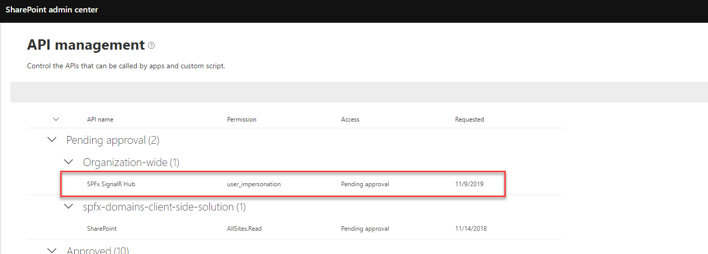

# Show the progress of your PnP Provisioning process with SharePoint Application customizer and SignalR

The [blog post](https://spblog.net/post/2019/11/19/show-the-progress-of-your-pnp-provisioning-process-with-sharepoint-application-customizer-and-signalr).

## How to configure to run locally

### 1. Prerequisites

You should configure Azure Storage account prior running the sample. For local development use Azure Storage Explorer with below artifacts:

#### Blob containers

`pnp-drone` - contains `templates.xml` - PnP Provisioning XML file and folder `assets` with required files. Template used in the demo is ["Contoso Drone Landing"](https://github.com/SharePoint/sp-dev-provisioning-templates/blob/master/tenant/ContosoDroneLanding/README.md)  
The structure:  


#### Queue

Create a queue with name `pnp-provision`.

#### Table

Create an Azure Table with name `PnPDroneProvisioning`.

#### Azure Logic app

Azure logic app receives web url from custom SharePoint Site Design. Similar to the [Calling Microsoft Flow from a site script](https://docs.microsoft.com/en-us/sharepoint/dev/declarative-customization/site-design-trigger-flow-tutorial), but Logic App instead of a Flow, because HTTP connector is premium.

### 2. Azure AD app registration

1. Create a new Azure AD app registration, enable implicit flow, add `user_impersonation` scope via Expose an API
2. Add API permissions - `SharePoint` - `Sites.FullControl.All`, `User.ReadWrite.All`
3. This sample uses Azure AD authentication based on certificates in order to generate an access token for SharePoint. Alternatively, you can use SharePoint-registered app
4. Create a new certificate to generate and sign access token from webjob (PowerShell):

   ```powershell
   $cert = New-SelfSignedCertificate -Subject "CN=SPFxSignalR" -CertStoreLocation "Cert:\CurrentUser\My"  -KeyExportPolicy Exportable -KeySpec Signature -NotAfter (Get-Date).AddYears(3)

    $bin = $cert.RawData
    $base64Value = [System.Convert]::ToBase64String($bin)
    $bin = $cert.GetCertHash()
    $base64Thumbprint = [System.Convert]::ToBase64String($bin)
    $keyid = [System.Guid]::NewGuid().ToString()
    $jsonObj = @{customKeyIdentifier=$base64Thumbprint;keyId=$keyid;    type="AsymmetricX509Cert";usage="Verify";value=$base64Value}
    $keyCredentials=ConvertTo-Json @($jsonObj) | Out-File "keyCredentials.txt"

   ```

5. This command will create a file called `keyCredentials.txt`. Go to Azure App Registration, then select `Manifest` and copy the content of `keyCredentials.txt` to `keyCredentials` node.
6. From your windows machine open Certificates snap-in, export private certificate `SPFxSignalR` from Personal certificates and add it into the solution (select "Copy always" in Visual Studio, so that this fille will be available under your `bin` output). You should protect the certificate with a password. The name of certificate is `cert.pfx`.
7. Under "Certificates & secrets" in Azure portal generate a new Client Secret.
8. Take a note on your App display name, App (Client) ID, Client Secret.

### 3.a Visual Studio: `SignalRHub`

1. Right click on a project -> Manage user secrets. Add below user secrets:

    ``` json
    {
        "AzureAd:Instance": "https://login.microsoftonline.com/",
        "AzureAd:TenantId": "<your tenant id>",
        "AzureAd:ClientId": "<client id from step #2>",
        "AzureWebJobsDashboard": "UseDevelopmentStorage=true"
    }
    ```

### 3.b Visual Studio: `ProvisioningJob`

Azure WebJob relies on some configuration settings, which should be provided via Environment variables. Edit your system environmental variables and add below variables:

- `SignalrHostUrl` - the host url part of your SignalR hub, i.e. https://localhost:44341
- `AzureAd:ClientId` - Client Id from step `#2`
- `AzureAd:ClientSecret` - Client Secret from step `#2`
- `AzureAd:TenantId` - Your Tenant Id
- `CertificatePassword` - password from `.pfx` certificate generated at step `#2`


### 4. SPFx

1. Open `pnp-notifier\config\package-solution.json` and under `webApiPermissionRequests` change resource name to match the display name from step `#2`
2. Open `pnp-notifier\src\extensions\consts.ts` and update `cientId` with one from step `#2`, `cloudHubUrl` should point to your Azure Web app url (when deployed).
3. Package solution, upload to App Catalog, approve Permission Request like described in the [Manage permission requests](https://docs.microsoft.com/en-us/sharepoint/dev/spfx/use-aadhttpclient#manage-permission-requests)



### 5. Add Site Script and Site Design

Under `PS\siteScript sample.ps1` change `url` to point to your Logic app trigger url. Add site design to your tenant using SP Online Management Shell.

### 6. Are you still here? Ok, run it!

Run `gulp serve` in SPFx folder (you need to change `serveConfigurations` under `pnp-notifier\config\serve.json` to match your tenant).

Run WebJob locally, run SignalR web application, add a new message into the `pnp-provision` queue in format:

```json
{
  "WebUrl": "https://<your org>.sharepoint.com/sites/drone-12"
}
```

Queue will trigger your web job, the job will send notification to your SharePoint web site through the SignalR hub.

## How to publish

1. Create a new Azure Web app.
2. Deploy SignalR hub into the Azure Web app.
3. Deploy WebJob to the same Azure Web app (AlwaysOn should be `true`).
4. On the Web app, add below App settings:

   - `AzureAd:ClientId` - Client Id of app registration on step `#2`
   - `AzureAd:Instance` - `https://login.microsoftonline.com/`
   - `AzureAd:TenantId` - your tenant id
   - `AzureWebJobsDashboard` - Azure storage connection string
   - `AzureWebJobsEnv` - `Production`
   - `CertificatePassword` - password from `.pfx` certificate generated at step `#2`
   - `SignalrHostUrl` - the host url part of your SignalR hub, i.e. `https://spfx-signalr-demo.azurewebsites.net`
